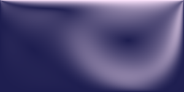

# lbm-fluid-sim
Real-time 2D Lattice Boltzmann fluid simulator in the browser (Work in progress)

## What it does
Simulates lid-driven cavity flow - a classic CFD benchmark where the top wall slides at constant speed, driving a recirculating vortex. Everything runs client-side in plain JavaScript on a 2D canvas: no libraries, no build step

## How it works
- D2Q9 lattice: 9 discrete velocity directions per cell
- BGK collision: (single relaxation time τ = 0.6) toward local equilibrium
- Push streaming with double buffering (ping-pong Float32Arrays)
- Bounce-back walls, with a momentum-corrected moving lid (Ladd-style)
- Rendering - velocity magnitude mapped to color, drawn via ImageData at 60 FPS

The distribution function is stored in a single flat Float32Array (contiguous memory, cache-friendly indexing) rather than nested arrays

## Verification
Correctness checks run on every load (see console):
- lattice weights sum to 1
- total mass conserved through collision, streaming, and wall reflections (sealed-box test over 100 steps)
- equilibrium at rest reproduces the lattice weights

## Performance
| Grid      | Cells | FPS      | Throughput |
|-----------|-------|----------|------------|
| 300×150   | 45K   | 60 (cap) | ~13.5M updates/s |
| 450×225   | 101K  | ~30      | ~15.2M updates/s |
| 600×300   | 180K  | ~16      | ~14.4M updates/s |

Throughput is flat across grid sizes (~15 MLUPS) — the current ceiling.

Profiled render-path caching and online-allocation elimination - no measurable gain; the ceiling is compute-bound. Next: WebGL port.

## Run it
Open `index.html` with any local server (e.g. VS Code Live Server).

## Roadmap
- [ ] Interactive obstacle placement (mouse)
- [ ] Render-path optimization
- [ ] Deployment (GitHub Pages)